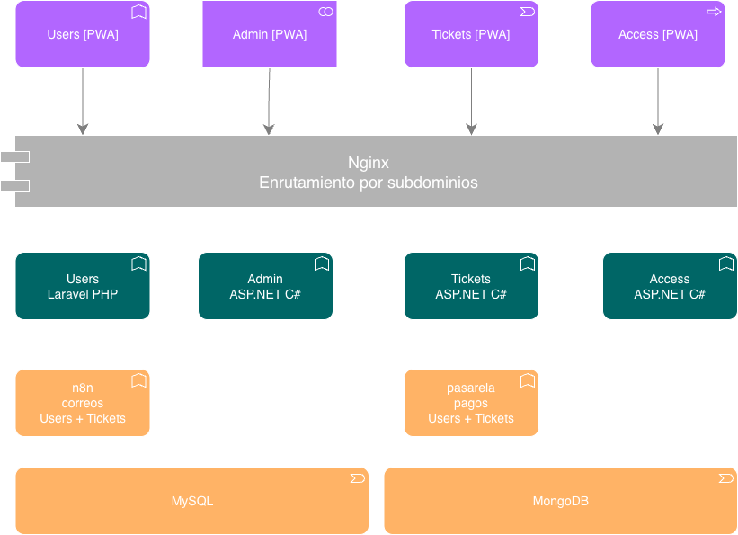

# events_infrastructure

> Infraestructura y orquestación del sistema de venta de boletas **Tickify**.

Este repositorio contiene la configuración compartida que orquesta los 4 monolitos del proyecto Tickify: reverse proxy, bases de datos, automatización de correos y documentación de arquitectura.

>  Este repo **no contiene los monolitos**. Cada uno vive en su propio repositorio (ver [Repositorios relacionados](#repositorios-relacionados)).

## Contexto

El Teatro RobinDev venía usando plataformas externas (TuBoleta y similares) para vender boletas y gestionar el acceso, pagando comisiones altas por cada transacción. Este sistema reemplaza esa dependencia con una plataforma propia dividida en 4 portales, cada uno con su dominio y responsabilidad propia.

| Portal | Subdominio | Para quién | Responsabilidad |
|---|---|---|---|
| Users | `quasar.andrescortes.dev` | Público | Catálogo, registro, compras online, perfil, favoritos, PQRS |
| Admin | `admin.quasar.andrescortes.dev` | Administrador | Eventos, empleados y permisos, PQRS, métricas |
| Tickets | `tickets.quasar.andrescortes.dev` | Taquilla física | Venta presencial, impresión, vinculación al cliente |
| Access | `access.quasar.andrescortes.dev` | Puerta del teatro | Escaneo, asignación de asiento, anti-fraude |

## Arquitectura



### Componentes

- **4 PWAs** — frontends instalables, una por portal, con branding propio
- **Nginx** — reverse proxy con TLS y ruteo por subdominio
- **4 monolitos backend:**
  - `users` — Laravel · PHP. Source of truth de identidad (auth, OAuth Google, JWT)
  - `admin` — ASP.NET Core · C#
  - `tickets` — ASP.NET Core · C#
  - `access` — ASP.NET Core · C#
- **MySQL 8** — base relacional compartida; una BD por monolito con usuario y grants restringidos
- **MongoDB 7** — colecciones `audit_logs` y `app_logs`, escritas por los 4 monolitos
- **n8n** — automatización de correos (consumido por Users y Tickets)
- **Pasarela de pagos** — _por definir (Wompi / ePayco / Mercado Pago / PayU)_

### Comunicación entre servicios

Síncrona vía REST/JSON. Detalle en [`docs/architecture/communication.md`](docs/architecture/communication.md). Resumen:

- Admin, Tickets, Access → Users: validan JWT en cada request protegido
- Tickets → Admin: consultan evento y precios al vender
- Tickets → Users: `find-or-create` del cliente al vender en taquilla
- Access → Tickets: validación atómica del QR (anti-fraude)
- Users, Tickets → n8n: webhooks de correo
- Users, Tickets → Pasarela: cobros online y en taquilla
- Todos → MongoDB: auditoría y logs

## Repositorios relacionados

- [`events_users`](#) — Laravel _(pendiente URL)_
- [`events_admin`](#) — ASP.NET Core _(pendiente URL)_
- [`events_tickets`](#) — ASP.NET Core _(pendiente URL)_
- [`events_access`](#) — ASP.NET Core _(pendiente URL)_

## Cómo levantar el proyecto en local

### Requisitos

- Docker Desktop (Mac/Windows) o Docker Engine + docker compose v2 (Linux)
- Git
- 8 GB de RAM disponibles (recomendado)

### Pasos

1. **Clonar este repo y los 4 monolitos** como carpetas hermanas:

```
   andromeda/
   ├── events_infrastructure/   ← este repo
   ├── events_users/
   ├── events_admin/
   ├── events_tickets/
   └── events_access/
```

2. **Configurar variables de entorno:**

```bash
   cd events_infrastructure
   cp .env.example .env
   # editar .env con tus valores
```

3. **Agregar los hosts locales** a `/etc/hosts` (Mac/Linux) o `C:\Windows\System32\drivers\etc\hosts` (Windows):

```
   127.0.0.1 quasar.local
   127.0.0.1 admin.quasar.local
   127.0.0.1 tickets.quasar.local
   127.0.0.1 access.quasar.local
```

4. **Levantar todo:**

```bash
   docker compose up -d
```

5. **Abrir en el navegador:** http://quasar.local

### Comandos útiles

```bash
docker compose ps                    # ver estado de los servicios
docker compose logs -f <servicio>    # ver logs en vivo
docker compose restart <servicio>    # reiniciar un servicio
docker compose down                  # bajar todo (mantiene los datos)
docker compose down -v               # bajar todo y borrar los datos
```

## Estructura del repo

```
events_infrastructure/
├── README.md
├── .env.example
├── docker-compose.yml
├── docs/
│   ├── architecture/        diagramas, ADRs, contratos
│   ├── flows/               diagramas de secuencia
│   └── branding/            guía de marca por PWA
├── nginx/
│   ├── nginx.conf
│   └── sites/               1 archivo por subdominio
├── mysql/
│   └── init/                scripts SQL: bases y usuarios
├── mongo/
│   └── init/                colecciones e índices
└── n8n/
    └── workflows/           exports JSON de los flujos de correo
```

## Documentación

- [Visión general de arquitectura](docs/architecture/overview.md)
- [Comunicación entre servicios](docs/architecture/communication.md)
- [Architecture Decision Records (ADRs)](docs/architecture/adr/)
- [Contratos de API (OpenAPI)](docs/api-contracts/)
- [Flujos de negocio](docs/flows/)
- [Guías de branding](docs/branding/)

## Equipo

_Por definir — roles_

- Faiber
- Jose
- Luis Miguel
- Verónica Martínez

